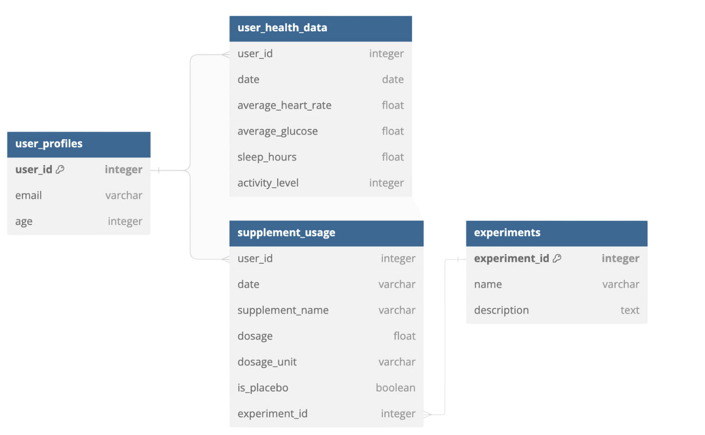
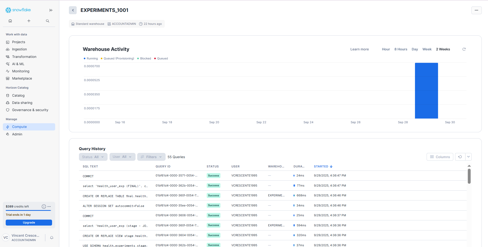
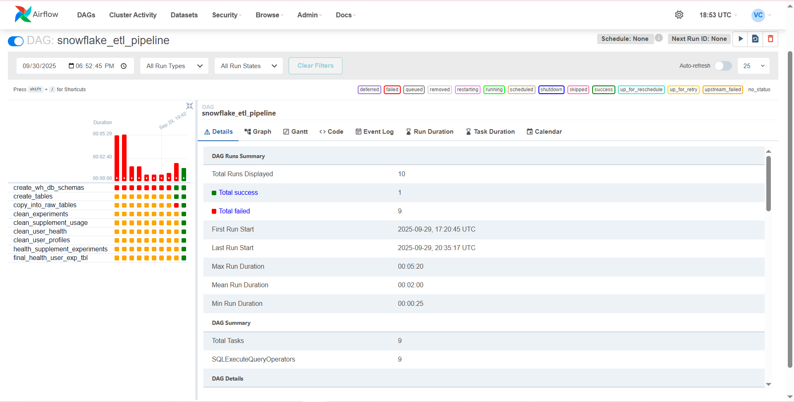

# Snowflake + Airflow ETL Project

## Description
This project demonstrates a modern data engineering workflow built from scratch for practice and portfolio purposes. It shows how to orchestrate ETL tasks using Apache Airflow and run transformations against a Snowflake data warehouse, with SQL and Python at the core.  

## Project Overview
- Orchestration: Apache Airflow manages DAGs (directed acyclic graphs) for task scheduling and execution.
- Transformations: SQL scripts are used for data transformations; dbt models can be added to extend modular transformations.
- Data Warehouse: Snowflake serves as the main analytical storage layer.
- Local Development: Airflow is run locally SQLite for local development.
- Version Control: Code and configuration are tracked in GitHub with appropriate .gitignore rules to keep the repository clean.

# Features
- Orchestrated ETL pipeline managed with Apache Airflow
- Data loading into Snowflake staging tables from local CSV files
- SQL-based transformations to clean and combine user profiles, user health data and supplement usage.
- Clear separation of staging, transformation and final layer for reproducibility
- Idempotent design ensuring safe reruns without duplicating records
- Clean, modular SQL scripts structured for maintainability and analytics readiness
- Final enriched Snowflake table that could be utilized for downstream analytics or
visualizations.

## Data Description

This project is based on data presented in the **Data Engineering Practical Exam** from [DataCamp.com](https://www.datacamp.com), which included meaningful cleaning, transformation, and merge tasks.

The dataset is synthetic, but the cleaning, transformation, and business logic closely mimic real-world workflows, including null value handling, replacements, joins, and type enforcement.

## Task Information Given in DataCamp

1001-Experiments makes personalized supplements tailored to individual health needs.

1001-Experiments aims to enhance personal health by using data from wearable devices and health apps.

1001-Experiments currently has the following four datasets with four months of data:
 - "user_health_data.csv" which logs daily health metrics, habits and data from wearable devices,
 - "supplement_usage.csv" which records details on supplement intake per user,
 - "experiments.csv" which contains metadata on experiments, and
 - "user_profiles.csv" which contains demographic and contact information of the users.

Each dataset contains unique identifiers for users and/or their supplement regimen.

The developers and data scientsits currently manage code that cross-references all of these data sources separately, which is cumbersome and error-prone.

Your manager has asked you to write a Python function that cleans and merges these datasets into a single dataset.

## Snowflake

Working with Snowflake was straightforward and clean. Using the SnowSQL CLI (`snowsql`), I connected with my account and user information (`-a`, `-u`) and executed SQL scripts in sequence to build out the warehouse and ingest data.  

Steps included:  
1. Creating the **warehouse** and **database**  
2. Creating the **tables** to receive data  
3. Using a **stage** and the `COPY INTO` command to load CSV files instead of manual drag and drop  
4. Creating individual scripts for each raw dataset (four total)  
5. Writing a master join to combine datasets into a unified table  
6. Applying final clean-up steps, such as reordering columns  

This process ensured reproducible ingestion and transformation within Snowflake.  

---

## Airflow

Apache Airflow was used to orchestrate the ETL pipeline and connect to Snowflake.  

Key steps included:  
- Installing **Python 3.11** (via `pyenv` on WSL) to avoid compatibility issues with Airflow  
- Creating and activating a **virtual environment** for dependency management  
- Installing and initializing Airflow (`airflow db init` / `airflow db migrate`)  
- Starting the Airflow webserver and creating a user via the CLI  
- Adding a **Snowflake connection** in the Airflow UI to securely manage credentials (Admin (dropdown) --> Connections)
- Placing DAG files (e.g., `etl-snowflake.py`) into the `dags/` folder for automatic discovery  
- Running DAGs via the Airflow UI and verifying execution through query history in Snowflake  

This setup allowed Airflow to fully orchestrate loading and transformation tasks into Snowflake.

> **Advanced Airflow Features (not used in this project)**  
> Airflow's powerful **Jinja templating** allows Python to dynamically inject values or variables into SQL or other tasks, such as dates, formatted dates, or relative dates like yesterday, using double curly braces `{{ }}`. This enables dynamic, parameterized queries in DAGs.  
> 
> Additionally, capturing the output of SQL queries typically requires using **XComs**, which allow tasks to pass data to each other. Without XComs, the default logging only shows a summary (e.g., number of records returned). For this project, I focused on using Airflow primarily as an **ETL orchestration system**, so I did not implement Jinja templates or XComs, but I am aware of their functionality and potential uses.

---

## Troubleshooting Notes

These notes reflect issues I encountered while integrating Airflow with Snowflake and how I resolved them:

- **Python version compatibility:** Although Airflow documentation lists multiple supported versions, I ran into issues with 3.12 on WSL and found 3.11 worked reliably for this project.  
- **Deprecated commands:** Some older setup commands like `airflow db init` may still work but are being phased out in favor of `airflow db migrate`.  
- **Snowflake Provider / Operators:** The legacy **Snowflake Operator** is now obsolete. Using the **SQL Execute Query Operator** worked well for my DAGs.  
- **Flask App Builder quirks:** Certain combinations of Airflow and Python versions caused the webserver to fail. Using compatible versions resolved these issues. 
- **Avoid SQL Native Comments**:  
  Using standard SQL comments (`-- comment`) inside SQL scripts caused Airflow to fail when executing tasks. This happens because Airflow uses **Jinja2 templating** to parse SQL files, and the parser can misinterpret lines starting with `--`, especially if the file has empty statements or template variables. As a result, the DAG task may break even though the SQL runs fine directly in Snowflake.

These observations are specific to my local setup and environment; they may differ depending on your system and Airflow version.

## Screenshots

Below is the `Snowflake UI` when clicking on the compute page.
Seeing the query history after manually triggering my dag from the Airflow UI demonstrates the scripts were actually called.

This is the `Airflow UI`, with the dag name **snowflake_etl_pipeline** with the defined tasks (on the left) in the python script. Each can be clicked on and see it's logging. 
After nine tries and utilizing the logs tab I was able to debug and get all tasks/sql scripts to run successfully (10 green squares).

